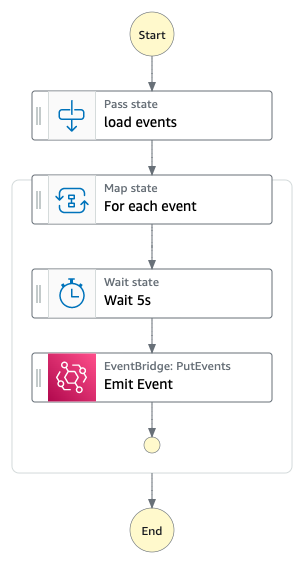

# Welcome to Serverlesspresso Extensions!

This section demonstrates the extensibility of event driven architectures. New functional requirements come up all the time in production applications. We can address new requirements for an event driven application by creating new rules for events in the Event Bus. These rules can add new functionality to the application without having any impact to the existing application stack.

This section shows how to build an extension for serverelsspresso that adds new functionality while remaining decoupled from the core application.

## Characteristics of an EDA extension

1. Extension resources do not have permission to interact with resources outside the extension definition (including core app resources).

2. Extensions must contain at least 1 new EventBridge rule that routes existing Serverlesspresso Events.

3. Extensions can be deployed and deleted independently of other extensions and the core application.

## The event player
 The event player is a Step Functions workflow that simulates 15 mins of operation at the Serverlesspresso bar. It does this by replaying an array of realistic events.

 Use the event player to generate Serverlesspresso events, when building and testing your extensions.

 ### Deploying the event player
 1. Clone this repository:
 `git clone https://github.com/aws-samples/serverless-coffee.git`

 2. Change directory to the event player:
 `cd extensibility/EventPlayer`

 3. Deploy the EventPlayer using the AWS SAM CLI:
`sam build and sam deploy --guided`

This deploys a Step Functions workflow and a custom event bus called *"Serverlesspresso"*

### Running the event player
1. Open the event player from the AWS Management Console
2. Choose **Start execution**, leave the default input payload and choose **Start execution**

The player will take approximately 
15 minutes to complete.

## Submitting your extension
Submit a Pull Request to this repository.
Your extension must contain a deployable IaC template, and a README.md file explaining the use case.

The best extensions will be added to the live Serverlesspresso application.

