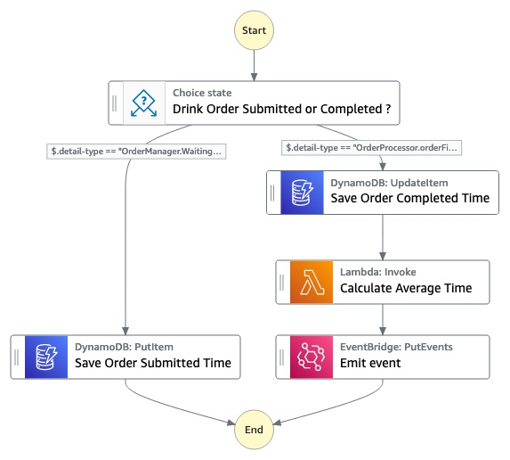

# Wait times Serverlesspresso Extension

This extension builds a Step Functions workflow triggered by two events: order submitted and order completed, both from an Event Bridge. It calculates average wait time per drink (e.g. Caffe Latte) and sends an event to the Event Bridge (bus named `Serverlesspresso`).

This app creates a Step Function, DynamoDB table, and Lambda function to compute wait times.

Below is the architecture diagram.


Before getting started, verify that your configuration matches the [list of requirements](#-requirements). Once done, simply open this project on your computer using your terminal.

## Deploy

You first need to install the dependencies of the project to make it ready to use. To do so, simply run the below command.

```bash
npm install
```

You will first need to ensure that the AWS CDK has been bootstrapped on the target account, this is typically the case if you have never used AWS CDK before on the account.

```bash
cdk bootstrap
```

> You only need to bootstrap the target account once, you can then dismiss this step. If you're planning on using multiple regions, the bootstrap process must be done for each AWS region.


Once the account has been bootstrapped and dependencies installed, you can deploy the solution using the following command.

```bash
cdk deploy
```

> AWS CDK will create and deploy a CloudFormation template on the sandbox account which you can view in the [CloudFormation console](https://console.aws.amazon.com/cloudformation/home) in the selected region.

## Cleanup

```bash
cdk destroy
```
## 🎒 Requirements

- [Node JS 12+](https://nodejs.org/en/) must be installed on the deployment machine. ([Instructions](https://nodejs.org/en/download/))
- The [AWS CDK CLI](https://aws.amazon.com/en/cdk/) must be installed on the deployment machine. ([Instructions](https://docs.aws.amazon.com/cdk/latest/guide/getting_started.html))
